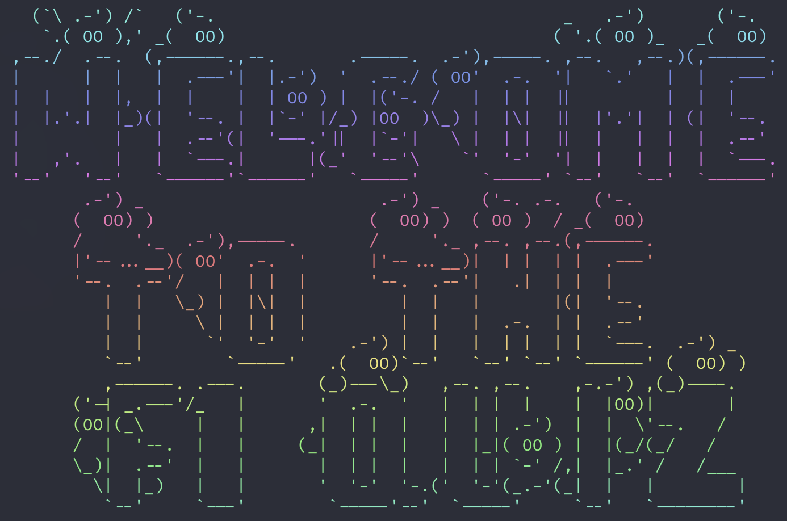

# F1 Quiz via CLI

**A command-line quiz game about Formula 1 trivia.**



## Features

- Interactive CLI quiz about Formula 1
- Multiple-choice questions
- Score tracking

## Take the Quiz

```
npx f1quiz
```

## Packages Used

- [`inquirer`](https://www.npmjs.com/package/inquirer): For interactive CLI prompts
- [`chalk`](https://www.npmjs.com/package/chalk): For colored terminal output
- [`chalk-animation`](https://github.com/bokub/chalk-animation): For animated text effects
- [`gradient-string`](https://github.com/bokub/gradient-string): For gradient text effects
- [`figlet`](https://www.npmjs.com/package/figlet): For ASCII art banners
- [`nanospinner`](https://github.com/usmanyunusov/nanospinner): For lightweight spinners

## Contributing

Pull requests are welcome. For major changes, please open an issue first.
